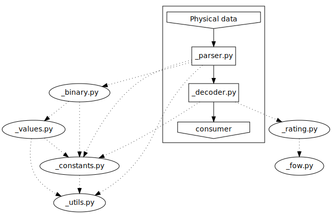

Code architecture
=================

| All code files are in only one directory.
| Tests are in a dedicated directory.

The two main "bricks" are **_parser.py** (physical data decoding) and **_decoder.py** (matching with database, and path finding).

.. toctree::
   :maxdepth: 1

Parser
------
The parser read the physical data (a string), decode it, and deserialize it in a data structure, whose type is depending of the read location reference :

* LineLocation
* PointAlongLineLocation
* GeoCoordinateLocation
* PoiWithAccessPointLocation
* CircleLocation
* RectangleLocation
* GridLocation
* ClosedLineLocation
* PolygonLocation

Decoder
-------
The decoder builds graph DB requests from the decoded location references, and builds the complete location reference relative to the provided specific map through the DB.
