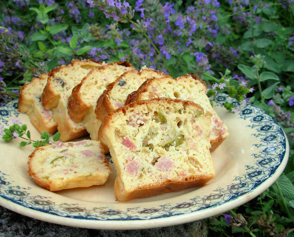

Olive cake recipe
=================

One of my savoury "cake" recipes from France. This recipe is slightly more substantial than my Chic and Cheerful - Savoury French Olive, Cheese and Onion Cake, as this recipe contains ham with white wine and port! Serve this as alternative sandwich bread or as a light snack spread with cream cheese or butter. This cake recipe will also make fantastic little appetisers if the loaf is cut into small cubes and served with olives, cubes of cheese and savoury spreads. Please note that the texture of this savoury cake is NOT like a sweet dessert cake - it will be slightly holey with a robust and slightly chewy texture, almost like sourdough. 

.. toctree::
   :maxdepth: 1

Ingredients
-----------

* 4 eggs
* 400 ml plain white flour
* 10 ml baking powder
* 80 ml olive oil
* 30 ml butter, melted
* 120 ml dry white wine
* 60 ml port wine
* 350 ml pitted green olives or 354.88 ml pitted black olives
* 500 ml chopped ham
* 500 ml gruyere or 473.18 ml emmenthaler cheese
* salt
* pepper

Directions
----------

#. Heat oven to 200C or 400°F.
#. In a bowl beat the eggs until pale yellow and frothy.
#. Stir in flour, baking powder, olive oil, melted butter, wine and port.
#. Chop the ham, cube the cheese and slice the olives.
#. Stir in ham, cheese, olives, salt and pepper to taste.
#. Pour into greased bread tin, loaf tin or cake pan (11 X 4 inches would be a good size).
#. Bake for about 50 minutes, or until well risen and golden brown.
#. Serve cold in slices or as sandwich bread.
#. This can be frozen in slices or as one whole loaf.

